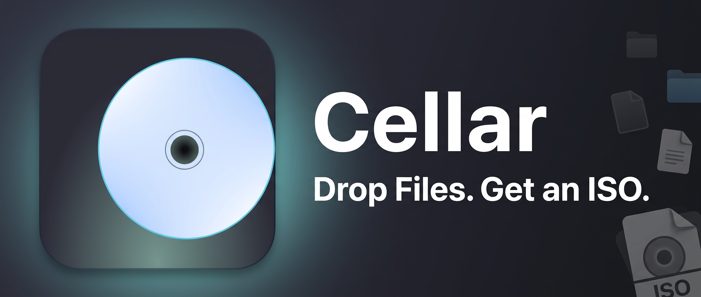

# cellar

Have files. Will ISO.

> Pull requests welcome — see [CONTRIBUTORS.md](CONTRIBUTORS.md) for build, test, and release workflows.

A small, cross-platform GUI for building ISO 9660 images. Single binary, no installer, no telemetry. Built because the existing options on Linux and macOS are either ancient KDE tools, Windows-only freeware, or browser-based services you don't want to feed sensitive files to.

## Status

MVP. Builds work end-to-end with a pure-Rust ISO 9660 writer. Joliet (Level 3) support for long filenames. Single binary, no external dependencies.

### Joliet label mode

The Joliet Supplementary Volume Descriptor (SVD) stores the volume label as UCS-2 big-endian. Some virtual CD-ROM readers (notably certain KVM/QEMU guest stacks) mis-decode this field and render the label as CJK garbage. Cellar offers two modes in the Output panel:

- **Strict (default)** — writes the label into the SVD as UCS-2 BE, per the Joliet spec. Correct for compliant readers.
- **Legacy** — leaves the Joliet volume label blank so buggy readers fall back to the Primary Volume Descriptor's ASCII label. Joliet long filenames are unaffected.

## Build

```
cargo build --release
```

The binary lands at `target/release/cellar`. No runtime dependencies — the ISO writer is built in.

### Drag-and-drop on Linux (Wayland)

winit 0.30 has no Wayland drag-and-drop implementation — only X11, Windows, and macOS. On Linux, cellar forces the X11 backend so the app routes through XWayland and DnD works. This workaround will be removed once [winit lands Wayland DnD support](https://github.com/rust-windowing/winit).

## Use

1. Drag files into the window (or click **Browse**).
2. Set a volume label. The output filename auto-syncs to `{label}-{timestamp}.iso` and can be edited independently.
3. Click **Build ISO**.

Files are hashed (SHA-256) as they're added and re-verified before build. A `.iso.sha256` sidecar is written next to the output.

### Research mode

Toggle in the top-right corner. Adds:

- A manifest section: source URL, package name/version, severity, references, notes. Both `MANIFEST.txt` (human-readable) and `MANIFEST.json` end up at the root of the ISO.
- Suspicious-path warnings: a confirmation dialog appears if any staged file matches paths like `.ssh`, `.aws`, `.gnupg`, or is over 100 MB. Catches the "I dragged the wrong folder" mistake before it ships to disc.

The intended use is malware-sample archival, but the manifest fields are generic enough for any provenance-tracking workflow.

## Headless CLI mode

Run `cellar --no-gui` to build an ISO from the command line — no window, no display server required.

```
cellar --no-gui --files file1.bin file2.dat --output out.iso --label MYDISK
```

| Flag | Short | Description |
|---|---|---|
| `--no-gui` | | Run without the GUI (required for headless) |
| `--output` | `-o` | Output ISO file path. Defaults to `{label}-{timestamp}.iso` in the working directory. |
| `--label` | `-l` | Volume label. Defaults to `CELLAR`. |
| `--legacy-label` | | Use Legacy Joliet label mode (blank SVD label) |
| `--files` | | Files to include in the ISO. At least one required. |

Manifest fields (optional — writing a manifest into the ISO requires at least one):

| Flag | Description |
|---|---|
| `--manifest-source` | Source URL |
| `--manifest-name` | Package name |
| `--manifest-version` | Package version |
| `--manifest-severity` | Severity |
| `--manifest-references` | References (one URL per line) |
| `--manifest-notes` | Freeform notes |

Examples:

```sh
cellar --no-gui --files evidence.bin --label CASE2026 -o /tmp/case.iso

cellar --no-gui --files sample.malware --label SAMPLE001 \
  --manifest-source "https://example.com/sample001" \
  --manifest-name "Sample001" \
  --manifest-severity high \
  --legacy-label
```

## Not in MVP

Deliberately scoped out for v0.1:

- **Directory drops** — files only. Recursive flattening surprises people.
- **Bootable ISOs** — no `-b` / El Torito support. Use `xorriso` directly if you need that.
- **Compression** — ISO 9660 doesn't really do that. If you want a compressed archive, use `.tar.zst`.
- **Signing** — no GPG integration. Sign the `.iso.sha256` yourself if you need authenticity.
